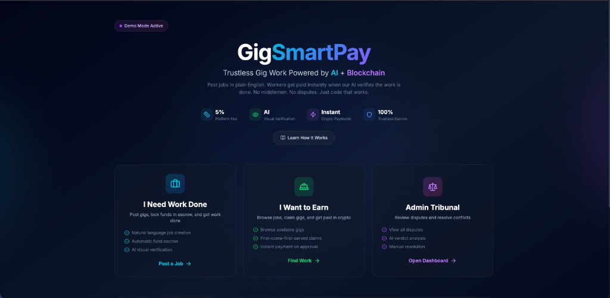
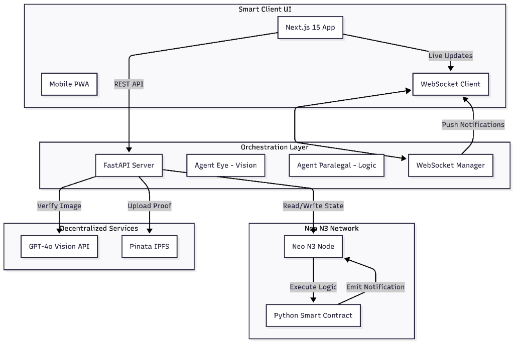
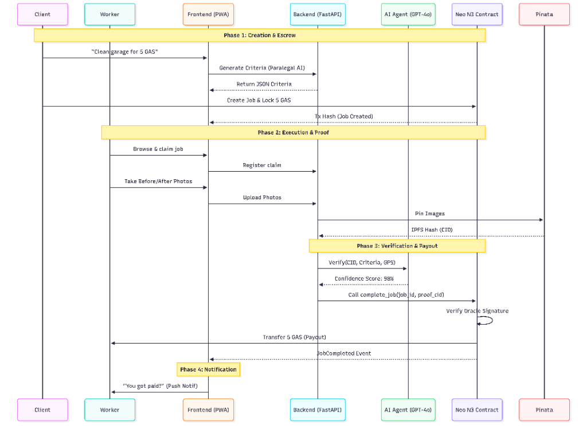

# [GigSmartPay](https://gig-smart-pay.vercel.app/)

**Trustless Gig Economy Platform powered by AI & Neo N3**



GigSmartPay is a decentralized application (dApp) that automates gig work verification and payments using multimodal AI and blockchain smart contracts. By replacing human intermediaries with an "AI Oracle," it enables trustless, instant, and fee-efficient micro-transactions for real-world tasks.

## ⭐ Key Features

*   **Trustless Escrow:** Funds are securely locked in a Neo N3 smart contract before work begins.
*   **AI Visual Verification:** GPT-4o Vision acts as a decentralized oracle, verifying "Before" vs "After" photos against naturally described job criteria.
*   **Instant Payouts:** Smart contracts execute programmatic releases of GAS immediately upon verification success—no manual approval needed.
*   **Zero-Human Pipeline:** A fully automated flow from job creation to wallet settlement.
*   **Dispute Tribunal:** A fallback mechanism for human adjudication in low-confidence scenarios.

---

## 🏗️ Architecture

The system follows a hybrid Web3 architecture, combining a Next.js frontend, a Python FastAPI orchestration layer, and on-chain logic.



### Core Workflow

1.  **Client** creates a job; funds are locked in the `GigShieldVault` smart contract.
2.  **Worker** claims the job and uploads proof photos via the PWA.
3.  **AI Agent** (Eye) processes the images, verifies GPS/Exif data, and generates a confidence score.
4.  **Backend** communicates with the Neo blockchain to trigger the `complete_job` transaction.
5.  **Smart Contract** releases funds to the worker wallet.



---

## 💻 Tech Stack

| Component | Technology | Description |
|-----------|------------|-------------|
| **Smart Contract** | Python + `boa3` | Logic deployed on Neo N3 Testnet |
| **Orchestrator** | FastAPI (Python) | Manages AI agents and blockchain write operations via `neo-mamba` |
| **Frontend** | Next.js 15 + TypeScript | Responsive UI with real-time WebSocket updates |
| **AI Engine** | OpenAI GPT-4o | Visual reasoning and criteria matching |
| **Storage** | IPFS (Pinata) | Decentralized, immutable storage for proof evidence |
| **Real-Time** | WebSockets | Instant state propagation to client clients |

---

## 📦 Repository Structure

The codebase is organized into three primary modules:

```bash
├── contracts/          # Smart Contracts source code (Python/boa3) and compilation scripts
├── backend/            # FastAPI server, AI Agents (Eye/Paralegal), and Neo N3 integration
├── web/                # Next.js 15 Frontend Application and PWA configuration
├── scripts/            # Utility scripts for wallet generation, funding, and deployment
└── assets/             # Project documentation assets and diagrams
```

---

## 🚀 Getting Started

Prerequisites:
*   Python 3.9+
*   Node.js 18+
*   Neo N3 Private Net (or access to Testnet)

### 1. Installation

```bash
# Backend Setup
cd backend
pip install -r requirements.txt

# Web Setup
cd web
npm install
```

### 2. Environment Configuration

Copy the example environment file and populate your keys:

```bash
cp .env.example .env
# Add your OPENAI_API_KEY, NEO_PRIVATE_KEY, and PINATA_KEYS
```

### 3. Running Locally

```bash
# Start the Backend Server (Port 8000)
cd backend && python3 api.py

# Start the Frontend (Port 3000)
cd web && npm run dev
```

Visit `http://localhost:3000` to interact with the application.
